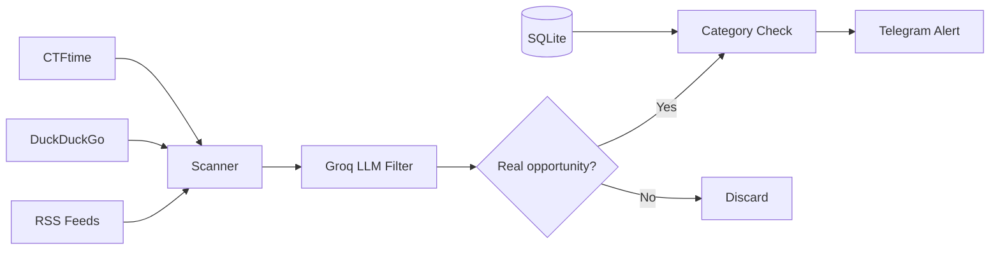

# snipe 🎯

> Telegram bot that hunts down hackathons, internships, fellowships, CTFs, and competitions — and texts you before the rest of the internet finds out.

Most opportunity aggregators are noisy or slow. Snipe runs every 30 minutes, filters results through an LLM, and only pings you when something is actually worth your time. **You choose what categories you care about.**

## Architecture



## How it works

1. Scans **RSS feeds + DuckDuckGo + CTFtime** every 30 minutes
2. **Groq LLaMA 3.1** filters out noise — only real, actionable opportunities pass
3. Checks your **category preferences** — you only get what you asked for
4. **SQLite** deduplication ensures you never see the same thing twice

## Commands

| Command | Description |
|---|---|
| `/start` | Subscribe to alerts |
| `/stop` | Unsubscribe |
| `/status` | Check your status and active filters |
| `/filter` | Choose which categories you want (inline keyboard) |
| `/scan` | Trigger a manual scan right now |
| `/stats` | View scan statistics |
| `/help` | Show all commands |

## Categories

| Emoji | Category |
|---|---|
| 🏆 | Hackathon |
| 💼 | Internship |
| 🎓 | Fellowship |
| 🏅 | Competition |
| 💰 | Grant / Scholarship |
| 🐛 | Bug Bounty |
| 🚩 | CTF |

Use `/filter` to toggle categories on/off. All are enabled by default.

## Setup

```bash
git clone https://github.com/Dreadonyx/snipe
cd snipe
pip install -r requirements.txt

# Set up your secrets
cp .env.example .env
# Edit .env with your Telegram bot token + Groq API key

# Optionally customize sources/keywords
cp config.example.yaml config.yaml

# Run
python -m snipe
```

You'll need:
- A Telegram bot token (from [@BotFather](https://t.me/BotFather))
- A free [Groq API key](https://console.groq.com)

## Project Structure

```
snipe/
├── snipe/
│   ├── __init__.py       # Package init
│   ├── __main__.py       # Entry point (python -m snipe)
│   ├── bot.py            # Telegram handlers & scheduler
│   ├── config.py         # Config loading & validation
│   ├── database.py       # SQLite (subscribers, prefs, logs)
│   ├── formatter.py      # LLM-powered alert formatting
│   └── scanner.py        # RSS, API, web search scanning
├── .env.example          # Secrets template
├── config.example.yaml   # Sources & keywords config
├── requirements.txt
├── Procfile              # Railway/Heroku deployment
└── README.md
```

## Deployment (Railway)

1. Push to GitHub
2. Connect repo on [Railway](https://railway.app)
3. Set environment variables: `TELEGRAM_TOKEN`, `GROQ_API_KEY`
4. Railway auto-detects the `Procfile` and runs `python -m snipe`

## Stack

- **Python** + python-telegram-bot
- **Groq API** (LLaMA 3.1) — opportunity classification
- **DuckDuckGo** — live web search
- **CTFtime** — CTF event feed
- **SQLite** — persistence
- **APScheduler** — automated scanning
